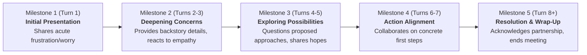

# Product Requirements Document (PRD)
## Dynamic Conversational Roleplay Engine & Dialogue Flow Modernization
### Resolving GitHub Issue #13: "Chatbot is not resulting in a conversational interaction"

---

## 1. Product Objective & Executive Summary

### 1.1. Problem Statement
In **Issue #13**, instructor Erik Jakobs reported:
> *"When I interact with the chatbot, I am just getting the "Exploration Node" response from the persona repeatedly. When using the original version of the chatbot, the AI would create the responses and add information that we did not have to program into the communication. This made the communication feel more real, and even two conversations with the same persona could take different paths. This also is where the opportunities to implement the LAFF strategy come into play."*

In the accompanying screenshots:
* **Current AACURA (`img1.png`)**: When tested on `learn.llslim.com` with the *Mary* persona, the chatbot repeated the exact canned sentence:
  > *"Well, yes, I suppose it's frustrating for my child too. What makes this new approach so much better?"*
  verbatim across three consecutive student turns, regardless of what the user input (even when asked unrelated input like *"How many stripes are on a zebra?"*).
* **Original EDURA (`img2.png` / `img3.png`)**: On `moodle.aac-learning-center.org`, the simulated parent (*Brianna / Wesley's mother*) maintained a rich, spontaneous, and empathetic 10-turn dialogue. The AI generated realistic school context (describing Wesley's classroom struggles, reacting enthusiastically to peer communication training, negotiating shared materials), giving the trainee authentic opportunities to apply each phase of the **LAFF "Don't Cry"** strategy before receiving a comprehensive 10-point rubric breakdown.

### 1.2. Objective
Transform the AACURA dialogue engine from a rigid, repetitive finite-state machine into a **dynamic, generative roleplay simulation** that preserves:
1. **Authentic, emergent conversational flow** where the AI persona responds contextually to trainee input, introduces realistic domain details, and exhibits emotional modulation based on how well the trainee applies LAFF principles.
2. **Pedagogical structure** where the dialogue naturally progresses across conversational milestones (Opening Concern → Deepening/Exploration → Collaborative Problem-Solving → Action Planning → Closure) over the designated turn minimum (default: 8 turns).
3. **Rigorous post-interaction LAFF evaluation** that scores the complete transcript against the rubric, citing specific turns and missed opportunities.
4. **Deterministic and safe fail-safes** that prevent silent fallback loops, config corruption, or repetitive canned responses.

---

## 2. Research Findings & Root Cause Analysis

A thorough forensic investigation of the codebase and database lifecycle revealed **four distinct root causes** contributing to the defect reported in Issue #13.

### 2.1. Root Cause A: Silent Configuration Overwrite in Diagnostics (Critical Bug)
In `local/aacuracore/classes/diagnostics_renderer.php` (line 640) and `local/aacuracore/cli/aacuradebug_scenario.php` (line 174):
```php
// diagnostics_renderer.php: line 640
set_config('engine_strategy', 'regex', 'local_aacuracore');
$engine = new \local_aacuracore\bot_engine($userid, $simcourse, 0, $code);
```
* **The Mechanism:** To run the 8-turn simulation card on the Diagnostics tab, the code called `set_config('engine_strategy', 'regex')`. However, `diagnostics_renderer.php` is instantiated **every single time an administrator loads the plugin settings page** (`admin/settings.php?section=local_aacuracoresetting`).
* **The Impact:** Every visit to the settings page in Moodle silently and permanently overwrote the site's `engine_strategy` from `external_llm` or `moodle_core_ai` back to `'regex'`.
* **The Result:** The bot engine switched to `regex_matcher_strategy`, which directly returns `$node['bot_prompt']` for whatever state the engine is in. No LLM was ever contacted.

### 2.2. Root Cause B: State Machine Minimum-Turn Trap
In `local/aacuracore/classes/bot_engine.php` (commit `6caff06`):
```php
// If a terminal state was reached before minimum turns, cycle back to EXPLORATION
if (($nextstatekey === 'RESOLUTION' || $nextstatekey === 'FAIL_STATE') && $turncount < $minturns) {
    $nextstatekey = 'EXPLORATION';
    $this->sessionrecord->current_state = $nextstatekey;
    $this->sessionrecord->timemodified = time();
    $DB->update_record('local_aacuracore_sessions', $this->sessionrecord);
}
```
* **The Mechanism:** Scenarios (`anna`, `brianna`, `cathy`, `mary`) are authored with only two non-terminal states: `START` and `EXPLORATION`. All other routes lead to `RESOLUTION`, `ESCALATION`, or `FAIL_STATE`.
* **The Impact:** Turn 1 starts at `START`. Once the student passes the empathy check, the engine transitions to `EXPLORATION`. On Turns 2 through 7, any successful response triggers `RESOLUTION`, but the condition forces `$nextstatekey = 'EXPLORATION'`.
* **The Result:** The conversation is artificially trapped in `EXPLORATION` for 6 consecutive turns.

### 2.3. Root Cause C: Over-Constrained Persona Prompt Template
In `local/aacuracore/classes/prompt_renderer.php`:
```
Current dialogue state requirement:
You are in the '{{statekey}}' state of the conversation.
On this turn, you must convey the following core concern: "{{stateprompt}}"
```
* **The Mechanism:** Even when an LLM API was active, the rendered system prompt commanded the model on *every turn* in `EXPLORATION`:
  `On this turn, you must convey the following core concern: "Well, yes, I suppose it's frustrating for him too. What makes this new approach so much better?"`
* **The Impact:** The system prompt explicitly forbade the LLM from progressing the conversation or answering the student's questions, forcing it to repeat the identical core concern on every turn.

### 2.4. Root Cause D: Uninformative Static Fallback
In `local/aacuracore/classes/strategy/generative_ai_api_strategy.php`:
```php
} catch (\Exception $e) {
    // Fallback to static prompt if cURL errors out
    return $stateprompt;
}
return $stateprompt;
```
* If an API call fails due to missing credentials, timeouts, or quota exhaustion, it silently returns `$stateprompt` without logging or alerting the user, creating the illusion of a frozen bot.

---

## 3. Comparison: Original EDURA vs. Current AACURA vs. Target Architecture

| Capability / Attribute | Original EDURA (`img2`/`img3`) | Current AACURA (`img1`) | Target Architecture (This PRD) |
| :--- | :--- | :--- | :--- |
| **Response Generation** | Generative LLM with full conversational context | Static node fallback or constrained prompt | Conversational generative LLM with milestone guidance |
| **Dialogue Progression** | Free-flowing, natural progression across 8-10 turns | Trapped in `EXPLORATION` node for turns 2–7 | Progressive dialogue phases (Open → Explore → Collaborate → Plan → Wrap) |
| **Information Depth** | Generates novel, realistic scenario details | Parrots single sentence in scenario JSON | Persona backstory seeded with rich situational anchors |
| **Pedagogical Alignment** | Student practices all 4 LAFF steps in context | Repetitive question prevents LAFF progression | Bot prompts naturally invite L, A, F, F responses |
| **Evaluation Timing** | Post-conversation holistic rubric evaluation | Turn 10 abrupt termination / state checks | Holistic transcript evaluation after N-turn minimum |
| **Fail-Safe Mechanism** | Unhandled API error message | Silent repetition of static node string | Graceful in-character dynamic fallback + admin alerts |
| **Admin Configuration** | Hardcoded settings | Vulnerable to silent overwrite in diagnostics | Tamper-proof, isolated simulation test harnesses |

---

## 4. Architectural Design: The Dual-Engine Conversational Framework

To resolve the tension between open-ended conversational realism and deterministic pedagogical assessment, AACURA adopts a **Dual-Engine Model**:

```
 ┌─────────────────────────────────────────────────────────────────────────────┐
 │                         Student Types Message in UI                         │
 └──────────────────────────────────────┬──────────────────────────────────────┘
                                        │
                                        ▼
 ┌─────────────────────────────────────────────────────────────────────────────┐
 │                         bot_engine Orchestrator                             │
 │   • Sanitizes input                                                         │
 │   • Appends to persistent database history (local_aacuracore_messages)      │
 │   • Determines Turn Count & Milestone Phase                                 │
 └──────────────────────┬──────────────────────────────┬───────────────────────┘
                        │ Turn < min_turns             │ Turn >= min_turns
                        ▼                              ▼
 ┌──────────────────────────────────────────┐   ┌──────────────────────────────┐
 │     1. Conversational Persona Engine     │   │   2. Evaluative Rubric Engine│
 │  (\strategy\generative_ai_api_strategy)  │   │  (generate_rubric_feedback()) │
 │                                          │   │                              │
 │ • System Prompt: Persona backstory,      │   │ • Input: Complete student    │
 │   communication style, emotional mood    │   │   turns from session history │
 │ • Milestone Guidance: Current phase goal │   │ • Rubric: LAFF "Don't Cry"   │
 │   (e.g., share challenge, propose step)  │   │   criteria & point allocation│
 │ • Dynamic Context: Full chat history     │   │ • Output: HTML Gradecard     │
 │ • Output: In-character, conversational   │   │   (Grade out of 10, earned   │
 │   response adding realistic details      │   │   points & missed moves)     │
 └──────────────────────────────────────────┘   └──────────────┬───────────────┘
                                                               │
                                                               ▼
                                                ┌──────────────────────────────┐
                                                │      Gradebook Sync          │
                                                │ (mod_aacurachat grading API) │
                                                └──────────────────────────────┘
```

### 4.1. Milestone-Driven Dialogue Progression (Replacing the Node Trap)
Instead of forcing every turn into a single hardcoded state node, the conversation progresses through **Pedagogical Milestones** mapped to turn intervals:



* **Milestones provide behavioral intentions**, not mandatory strings:
  - *Milestone 1:* Express the primary emotional pain point (e.g. *"I'm overwhelmed; the app isn't working"*).
  - *Milestone 2:* If the trainee validates feelings and asks permission to take notes, open up about daily life struggles. If trainee is defensive or jargon-heavy, push back or express confusion.
  - *Milestone 3:* Discuss specific barriers (grandparents, classroom isolation, embarrassment). Solicit ideas from the trainee.
  - *Milestone 4:* React positively to practical, actionable suggestions (LAFF Step 4: Find a first step).
  - *Milestone 5:* Wrap up with appreciation and confirm agreed-upon next steps.

---

## 5. Phased Implementation Roadmap

```
┌─────────────────────────────────────────────────────────────────────────────┐
│                    PHASED IMPLEMENTATION ROADMAP                            │
├─────────────────────────────────────────────────────────────────────────────┤
│  PHASE 1: Immediate Engine Bug Fixes & Generative Restoration               │
│  ├── Fix silent config overwrite in diagnostics_renderer.php & CLI          │
│  ├── Decouple generative prompt from static stateprompt regurgitation       │
│  ├── Enhance prompt_renderer template for emergent conversational context   │
│  └── Implement robust error logging when LLM API returns empty/fails        │
├─────────────────────────────────────────────────────────────────────────────┤
│  PHASE 2: Conversational Milestone Architecture                             │
│  ├── Define milestone stage schemas in scenario definitions                 │
│  ├── Implement turn-based conversational stage routing in bot_engine        │
│  ├── Support persona backstory rich details (events, family context)       │
│  └── Update all default scenarios (anna, brianna, cathy, mary) with stages  │
├─────────────────────────────────────────────────────────────────────────────┤
│  PHASE 3: Dynamic Emotional Modulation & LAFF Reactivity                    │
│  ├── Persona emotional state dynamically shifts (defensive -> cooperative)   │
│  ├── Real-time recognition of trainee LAFF moves (empathy, note permission) │
│  └── Resistance escalation when trainee commits CRY infractions             │
├─────────────────────────────────────────────────────────────────────────────┤
│  PHASE 4: Transcript Analytics, Diagnostics & Instructor Controls           │
│  ├── Enhanced Diagnostics verification of generative multi-turn pathways    │
│  ├── Student transcript export & review dashboard                           │
│  └── Automated regression testing for multi-turn non-repetitive dialogue    │
└─────────────────────────────────────────────────────────────────────────────┘
```

---

## 6. Phase 1 Technical Specification (Immediate Release)

### 6.1. Bug Fix 1: Eliminate `set_config` in Diagnostics & CLI
* **File:** `local/aacuracore/classes/diagnostics_renderer.php`
* **File:** `local/aacuracore/cli/aacuradebug_scenario.php`
* **Action:**
  - Remove `set_config('engine_strategy', 'regex', 'local_aacuracore');` from both files.
  - In `render_full_turn_simulation()`, instantiate `bot_engine` without mutating global configuration. If a simulation requires deterministic mock behavior, pass a mock strategy or run it in an isolated temporary session without altering `$CFG` or `mdl_config_plugins`.
  - Ensure the admin's configured strategy (`moodle_core_ai`, `external_llm`, or `local`) is preserved across all page reloads.

### 6.2. Enhancement 2: Redesign Persona System Prompt Template
* **File:** `local/aacuracore/classes/prompt_renderer.php`
* **Change:** Replace the rigid `On this turn, you must convey the following core concern: "{{stateprompt}}"` directive with **Conversational Persona Roleplay Directives**:

```markdown
You are {{persona_name}}.
Backstory: {{backstory}}
Communication Style: {{communication_style}}
Intensity Level: {{parent_intensity}}

ROLEPLAY INSTRUCTIONS:
1. You are having an authentic, face-to-face conversation with a teacher or SLP.
2. Read the entire conversation history carefully. Respond directly to what the teacher just said.
3. Build naturally on the conversation. You may share realistic details about your daily life, your child's habits, and your past experiences that align with your backstory.
4. Do NOT repeat yourself or repeat questions you already asked earlier in the conversation.
5. If the teacher expresses empathy or asks thoughtful questions, become more collaborative and receptive.
6. If the teacher uses confusing jargon or dismisses your concerns, express confusion or mild defensiveness.
7. Keep each response between 2 and 4 sentences so it feels like natural dialogue.
```

### 6.3. Enhancement 3: Multi-Turn Stage Progression in `bot_engine.php`
* **File:** `local/aacuracore/classes/bot_engine.php`
* **Change:**
  - Remove the hardcoded override that resets `$nextstatekey = 'EXPLORATION'` continuously.
  - Track conversation progress through conversational stages (`OPENING`, `EXPLORATION`, `DEEPENING`, `COLLABORATION`, `WRAPUP`) based on turn ratio:
    - Turns 1: Opening & initial concern.
    - Turns 2–3: Exploring details & sharing examples.
    - Turns 4–5: Examining potential solutions & barriers.
    - Turns 6–7: Agreeing on first steps & practical actions.
    - Turn 8+: Concluding the meeting.
  - Pass the current milestone goal into the prompt renderer so the persona naturally shifts its conversational stance over time.

### 6.4. Bug Fix 4: Graceful Dynamic Fallback & Explicit API Logging
* **File:** `local/aacuracore/classes/strategy/generative_ai_api_strategy.php`
* **Change:**
  - If `chat_completions` encounters an exception or returns an empty payload:
    1. Log an explicit `debugging('[AACURA] LLM API Call Failed: ' . $e->getMessage(), DEBUG_DEVELOPER)` notice.
    2. Instead of returning the exact same `$stateprompt` every turn, generate a context-aware fallback response from an array of in-character dynamic responses, or alert the user that the AI provider connection timed out.

---

## 7. Verification & Acceptance Criteria

| ID | Test Scenario | Expected Outcome |
| :--- | :--- | :--- |
| **AC-1** | Settings Page Reload | Visiting `Site administration > Plugins > Local plugins > AACURA Settings` does NOT alter `local_aacuracore/engine_strategy`. |
| **AC-2** | Multi-Turn Diversity | Conducting an 8-turn conversation with any persona produces 8 distinct, non-repetitive responses from the bot. |
| **AC-3** | Contextual Reactivity | Answering a persona's question causes the bot to respond directly to the answer, rather than repeating the question. |
| **AC-4** | Off-Topic Handling | Sending an unrelated query (e.g. *"How many stripes on a zebra?"*) causes the persona to react in character (e.g., expressing confusion or refocusing on their child), NOT repeating a canned exploration prompt. |
| **AC-5** | LAFF Step Efficacy | Demonstrating LAFF principles (validating feelings, asking to take notes, asking open questions) causes the persona to become more cooperative and open. |
| **AC-6** | Holistic Rubric Delivery | At Turn 8 (or configured minimum), the evaluation engine produces a full HTML rubric card scoring the student out of 10 with turn citations and missed opportunities, synchronizing the grade to the Moodle Gradebook. |
| **AC-7** | Error Visibility | If the LLM API fails (e.g. invalid key), developer debugging logs report the exact error, and the UI provides a clear diagnostic indicator rather than an infinite loop of static text. |

---

## 8. Pedagogical Alignment: Universal LAFF "Don't Cry"

In accordance with workspace rules and [GEMINI.md](file:///d:/projects/windows/AAC-RERC%20Chatbot/GEMINI.md), the **LAFF "Don't Cry"** framework remains the universal foundation for all simulated personas:
* **L (Listen, Empathize, Validate):** The persona introduces emotional tension that requires active listening and validation.
* **A (Ask Questions & Permission to Take Notes):** The persona responds favorably when the trainee asks to take notes and asks open-ended clarifying questions.
* **F (Focus on Practical Issues):** The persona shares concrete daily living challenges (e.g., grandfather's tech difficulty, playground isolation).
* **F (Find First Steps):** The dialogue culminates in collaborative agreement on immediate, achievable actions.
* **Don't Cry:** If the trainee criticizes, reacts defensively, or uses unexplained jargon, the persona naturally reacts with hurt, pushback, or confusion, offering direct pedagogical consequence in the simulation.
