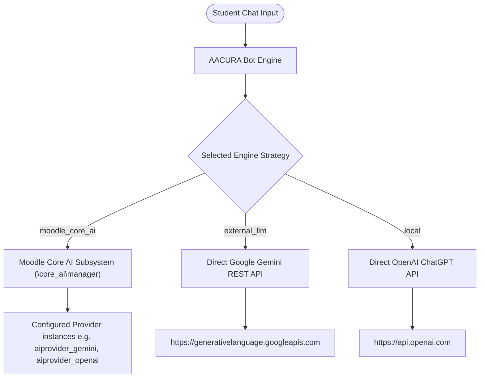

# AACURA Chatbot - Moodle Site Administrator Setup Guide

This guide provides step-by-step instructions for Moodle site administrators to create and configure an AI provider and set up the **AACURA** (AAC Understanding & Reflective Assistant) dialogue engine.

---

## 🏗️ AI Integration Options Overview

AACURA can process chatbot responses and student rubric evaluations through three different strategy backends:



1. **Moodle Core AI Subsystem (`moodle_core_ai`)**: 
   *(Recommended for Moodle 4.5+)* Centralizes AI provider API credentials and rate limits under Moodle's native AI subsystem.
2. **Google Gemini Direct REST API (`external_llm`)**:
   Connects directly to Google's Gemini models using a standard Google AI Studio API key, bypassing Moodle's core AI subsystem.
3. **ChatGPT (OpenAI Direct API) (`local`)**:
   Connects directly to OpenAI's ChatGPT models using an OpenAI API key.

---

## 🔌 Part 1: Configuring Moodle Core AI Providers (Moodle 4.5+)

If you choose the **Moodle Core AI** strategy, you must first define and enable an AI provider instance inside Moodle's global settings:

### Step 1: Access AI Provider Settings
1. Log in to your Moodle site as an **Administrator**.
2. Navigate to **Site administration > General > AI providers**.

### Step 2: Create a New Provider Instance
1. Click the **Create a new provider instance** button.
2. Select the appropriate provider plugin:
   - **Google Gemini Provider** (`aiprovider_gemini`) - for Gemini model integration.
   - **OpenAI Provider** (`aiprovider_openai`) - for ChatGPT model integration.
3. Fill in the required credentials:
   - **API Key**: Input your API key (obtained from Google AI Studio or OpenAI Platform).
   - **Endpoint / Base URL** (if prompted/customizable): Keep default unless utilizing a proxy or enterprise gateway.
4. Click **Save changes**.

### Step 3: Configure Provider Action Settings
1. On the **AI providers** overview page, ensure the status toggle for your new provider instance is set to **Enabled**.
2. Click the **settings** link next to the provider instance.
3. Locate the **Generate text** action (`\core_ai\action\generate_text`).
4. Ensure the **Generate text** action is **Enabled** (this is the specific API action AACURA uses to generate persona responses and evaluate criteria).
5. Specify the default model to use for text generation (e.g., `gemini-1.5-flash` or `gpt-4o-mini`).
6. Configure site-wide or user-specific rate limits if necessary to prevent budget overruns.

---

## ⚙️ Part 2: Configuring AACURA Plugin Settings

Once your AI provider (or direct REST credentials) is ready, you must configure the AACURA plugin settings page:

### Step 1: Access AACURA Settings
1. Navigate to **Site administration > Plugins > Local plugins > AACURA Settings** (or go to URL `/admin/settings.php?section=local_aacuracoresetting`).

### Step 2: Configure Global & Strategy Settings
Configure the settings described below:

| Field Name | Setting Key | Description / Value |
| :--- | :--- | :--- |
| **Mode** | `local_aacuracore/mode` | Set to **GeniaI** (`geniai`) to enable the AI dialogue engine. (Set to `none` to disable, or `assistant` for helper modes). |
| **Engine Strategy** | `local_aacuracore/engine_strategy` | Select the active strategy:<br>• `moodle_core_ai` — Uses Moodle's native AI providers.<br>• `external_llm` — Uses Direct Google Gemini REST API.<br>• `local` — Uses Direct OpenAI ChatGPT API. |
| **Active Scenarios** | `local_aacuracore/active_scenarios` | Select which student simulation personas are active (e.g. *Anna Charles*, *Brianna Mitchell*, *Cathy Fratner*, *Mary*). |

---

### Step 3: Configure Strategy-Specific Fields
The settings page will show interactive cards that expand/collapse based on your selected strategy:

#### Option A: If "Moodle Core AI" Strategy is Selected
- **Selected Core AI Provider** (`local_aacuracore/core_ai_selected_provider`): Select the Moodle-configured provider to dispatch prompts to (e.g., `aiprovider_gemini` or `aiprovider_openai`).
- **Apply generation parameters to Moodle Core AI** (`local_aacuracore/core_ai_apply_generation`): When enabled (default), the temperature/Top_p from the selected **Use Case** profile are written into the active provider's **Generate text** action configuration. Moodle Core AI does not support per-call sampling parameters, so this is the supported way to control sampling on the Core AI path.

#### Option B: If "Google Gemini Direct REST API" Strategy is Selected
- **API Base URL** (`local_aacuracore/api_base_url`): Set to `https://generativelanguage.googleapis.com/v1beta/openai` (the OpenAI-compatible base URL for Gemini models).
- **API Bearer Token** (`local_aacuracore/api_bearer_token`): Input your Gemini API key (e.g. starting with `AIzaSy...`).
- **Model Identifier** (`local_aacuracore/model_identifier`): Input the model name, typically `gemini-3.5-flash`.

#### Option C: If "ChatGPT (OpenAI Direct API)" Strategy is Selected
- **API Key** (`local_aacuracore/apikey`): Input your OpenAI API key (e.g., starting with `sk-...`).
- **Model** (`local_aacuracore/model`): Select `gpt-4o-mini` (recommended for cost-efficiency) or other models like `gpt-4` or `gpt-4-turbo`.

---

### Step 4: Set Global Generation Parameters
These parameters are **global** — they apply to all AI engines (Moodle Core AI, Google Gemini, and ChatGPT/OpenAI), not just one strategy:

1. **Use Cases** (`local_aacuracore/case`): Choose the temperature/Top_p profile (e.g. **Chatbot** for low temperature / deterministic responses, or **Balanced** for slightly creative interactions). This maps to the `temperature` and `top_p` sampling parameters sent to the LLM.
2. **Max Tokens** (`local_aacuracore/max_tokens`): Set the output length limit. The default is `200` tokens, which is sufficient for 2-4 sentences from the parent persona.
3. **Frequency/Presence Penalties** (`local_aacuracore/frequency_penalty`, `local_aacuracore/presence_penalty`): Keep at `0.0` unless you need to adjust dialogue repetition. Note that direct Gemini REST calls auto-sanitize zero-values to avoid model errors.
4. **Voice** (`local_aacuracore/voice`): Choose the default Voice for Text-To-Speech features (e.g., *Alloy*, *Echo*, *Fable*, *Onyx*, *Nova*, *Shimmer*).
5. **Minimum student turns before grading** (`local_aacuracore/min_turns`): Set the **minimum** number of student exchanges the conversation must run before it is automatically evaluated and graded. The default is **8**. The dialogue continues for at least this many turns even if a terminal state (RESOLUTION / FAIL_STATE) is reached early. This is the global default; individual activity instances (`mod_aacurachat`) and scenario JSON (`min_turns`) can override it. (Backward-compatible fallback reads from legacy `max_turns`).
6. **Parent Assertiveness / Aggressiveness** (`local_aacuracore/parent_intensity`): Dial the simulated parent's assertiveness/aggressiveness up or down (Very Low → Very High). This injects a behavior instruction into the persona's system prompt so the LLM plays the parent more passively or more confrontationally. This is the global default; individual activity instances can override it.
7. **Persona System Prompt Template (Global)** (`local_aacuracore/prompt_template`): A site-wide default LLM system prompt for the persona. Applies to all scenarios unless a scenario defines its own `prompt_template`. You can view how each scenario's prompt resolves in **Diagnostics → Persona System Prompt Preview**.
8. **Evaluation (Rubric) System Prompt (Global)** (`local_aacuracore/evaluation_prompt_template`): The LLM system prompt for the **second call** that grades the conversation and produces rubric feedback. You can view it in **Diagnostics → Evaluation (Rubric) System Prompt**.
9. **Scenario Registry & Custom Scenarios**: Click the **🛠️ Manage Personas & Open Scenario Builder** button under Active Scenarios to open the site-wide registry (`/local/aacuracore/scenario_builder.php`). From there, administrators can upload custom scenario `.json` files, view active registered personas, or remove custom scenarios.
10. **Moodle Modules Integration**: Select which Moodle activity modules (e.g., glossary, quiz, wiki) the core plugin will integrate with.

Click **Save changes** at the bottom of the page to apply the configurations.

---

### The Two AI Prompts (and when they are called)

A simulated roleplay conversation uses **two distinct LLM system prompts**:

1. **Persona System Prompt** (`prompt_template`) — used for the **parent-persona turn generation**.
   - **When it is called:** once per teacher reply, on every regular turn, to generate the parent's in-character response.
   - **What it contains:** persona name, backstory, communication style, the parent's intensity, the current dialogue state, and the core concern to convey.
   - **Contains rubric?** No — the parent persona does not (and should not) know the grading rubric.

2. **Evaluation (Rubric) System Prompt** (`evaluation_prompt_template`) — used for the **rubric feedback generation**.
   - **When it is called:** once, after the conversation ends — when the student has completed the **minimum** turn count (`min_turns`, default **8**) and the conversation has run its full course (terminal state reached at/after the minimum).
   - **What it contains:** the teacher's replies only, the `{{rubric}}` criteria (injected from the scenario's per-state `rubric` arrays), the LAFF scoring/feedback instructions, and the HTML output format.
   - **Contains rubric?** Yes — via the `{{rubric}}` placeholder.

Both templates are editable in Settings and previewed read-only in the **🩺 Diagnostics** tab.

### N-Turn Minimum Verification

The **Diagnostics** tab includes a **🔄 Full Minimum-Turn Simulation** that runs a deterministic (regex-strategy) conversation for the full **N-turn minimum** (default 8) on each persona and records whether the conversation terminates early. Results are persisted to the `local_aacuracore_sim_log` table so admins can review the **most recent run per persona** (shown in the **🗂️ Simulation Log** card). The same simulation is available via the CLI diagnostics tool: `php local/aacuracore/cli/aacuradebug_scenario.php --simulate`.

---

## 🧪 Part 3: Verification & Troubleshooting

After configuring the settings, follow these steps to verify that the connections work:

### 1. Run Setup Diagnostics (CLI)
For command-line diagnostics and configuration status logs:
```bash
php local/aacuracore/cli/aacuradebug_scenario.php --check-configs
```
This utility tests the API credentials, checks the availability of your active strategy engine, and reports error details.

### 2. Run Scenario Graph crawler tests
Ensure the scenario transition flows are healthy:
```bash
php local/aacuracore/cli/aacuradebug_scenario.php --phpunit
```
This runs the phpunit unit tests for all scenario transitions (e.g., validating the class `local_aacuracore\scenarios_test`).

### 3. Enable Developer Debugging
If responses are failing to generate:
1. Turn on Moodle's developer logs via CLI:
   ```bash
   php local/aacuracore/cli/aacuradebug_scenario.php --enable-debug
   ```
   (Alternatively, go to **Site administration > Development > Debugging**, set **Debug messages** to **DEVELOPER**, and enable **Show debug information**).
2. Check Moodle logs (`/var/log/nginx/error.log` or similar) or test chat responses directly in the UI to see detailed exception messages.
3. Once completed, turn off debugging:
   ```bash
   php local/aacuracore/cli/aacuradebug_scenario.php --disable-debug
   ```
